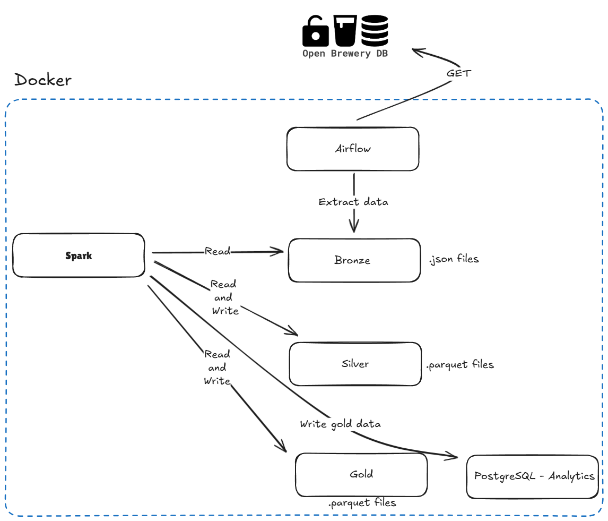

# Brewery Data Pipeline

This project implements a data pipeline to collect and store information about breweries using the OpenBreweryDB API, following the Medallion Architecture:

- **Bronze Layer**: Raw data from the API, stored in MinIO.  
- **Silver Layer**: Data transformed into a columnar format, partitioned by brewery location.  
- **Gold Layer**: Aggregated view showing the count of breweries per type and location, optionally loaded into PostgreSQL for analytics.

---

## Overview

The pipeline is orchestrated by [Apache Airflow](https://airflow.apache.org/) and consists of a DAG (Directed Acyclic Graph) with the following high-level steps:

1. **Check API Availability**  
   Verifies the status of the [OpenBreweryDB API](https://api.openbrewerydb.org/breweries) before proceeding.

2. **Extract Brewery Data**  
   Fetches brewery data (including pagination) from the API.

3. **Store Data in Bronze Layer**  
   Saves the raw JSON response to a Bronze bucket in MinIO, preserving the unmodified data.

4. **Process and Store Data in Silver Layer**  
   Reads from the Bronze layer, cleans and standardizes columns, and writes the transformed data back to MinIO in Parquet format, partitioned by location.

5. **Process and Store Data in Gold Layer**  
   Aggregates the Parquet data from the Silver layer, writes the aggregated output back to MinIO, and inserts it into a PostgreSQL database for easy querying.

---

## Architecture Diagram




---
## Technologies

- **Apache Airflow**: Orchestrates tasks and scheduling.  
- **Python**: Main language for operators, API requests, and orchestration logic.  
- **Apache Spark (PySpark)**: Handles large-scale data transformations and aggregations for the Silver and Gold layers.  
- **MinIO**: S3-compatible storage for Bronze, Silver, and Gold data layers.  
- **Docker**: Containerizes the entire application for portability and modularity.  
- **PostgreSQL**: Stores aggregated Gold layer data for direct query access.  
---
## Prerequisites

- [Docker](https://www.docker.com/)  
- [Docker Compose](https://docs.docker.com/compose/)  

---

## Setup

1. **Clone the repository**:
   ```bash
   git clone https://github.com/henrique-af/datalake-breweries-two.git
   cd datalake-breweries-two
   ```

2. **Configure environment variables**:  
   Create a `.env` file in the project root with the following content:
   ```bash
   AIRFLOW_UID=50000
   AIRFLOW_GID=50000
   ```

3. **Start services**:
   ```bash
   docker-compose up -d
   ```
   This command spins up Airflow (including workers, scheduler, webserver), MinIO for storage, and PostgreSQL for Gold data.

4. **Access Airflow Web Interface**:
   ```
   http://localhost:8080
   ```
   - Username: `admin`
   - Password: `admin`

5. **Activate the DAG**:  
   In Airflow, enable the `brewery_pipeline` DAG to begin scheduled runs or trigger a manual run from the UI.

---

## Access Credentials

### Airflow Web Interface:
- Username: `admin`  
- Password: `admin`  

### MinIO:
- Access Key: `minio`  
- Secret Key: `minio123`  

Buckets used:
- `bronze`
- `silver`
- `gold`

### PostgreSQL:
- Host: `postgres-analytics`  
- Port: `5432`  
- Database: `brewery_analytics`  
- User: `analytics`  
- Password: `analytics123`  

---

## DAG Structure

The pipeline consists of five main tasks:

1. **check_api**  
   Uses Airflow’s `HttpSensor` to ensure that OpenBreweryDB API is available before proceeding.

2. **extract_breweries**  
   Fetches brewery data via a custom operator (`APIExtractorOperator`) with pagination support.

3. **store_bronze**  
   Writes raw JSON data to MinIO's Bronze bucket using a custom operator (`WriteBronzeLayerOperator`).

4. **process_silver**  
   Transforms raw JSON into Parquet format using PySpark (`ProcessSilverLayerOperator`). The data is partitioned by location (state) for efficient querying.

5. **process_gold**  
   Aggregates brewery counts by type and location using PySpark (`ProcessGoldLayerOperator`). Results are written to both MinIO (Gold bucket) and PostgreSQL (`gold_layer.brewery_summary`).

---

## Why Tests Were Not Included

Although tests are critical for ensuring code quality and reliability in production pipelines, they were not fully implemented in this solution due to time constraints.

### Why Tests Are Important:
1. Validate individual components like custom operators to ensure they behave as expected under normal and edge cases.
2. Ensure that components work together seamlessly—for example, verifying that data flows correctly from Bronze to Silver.
3. Validate that the entire pipeline runs successfully with real or mock data.

---

## Monitoring & Alerting

Monitoring is essential for production pipelines to detect failures or anomalies early on.

### Current Setup:
1. Airflow provides built-in monitoring through its UI.  

### Future Enhancements:
1. Add *on_failure_callback* functions in Airflow tasks to send Slack or email alerts when tasks fail.
2. Implement basic *data quality checks* before transitioning between layers:
    - Minimum record count validation.
    - Ensure critical columns (`id`, `brewery_name`) are not null or empty.
3. Integrate with external tools for real-time monitoring of task durations or failures.

---

## Trade-offs & Design Choices

1. **Why Airflow?**
    - Provides robust orchestration with built-in retries, scheduling, and monitoring.
    - Easily extensible with custom operators for specific tasks like API extraction or Spark transformations.

2. **Why PySpark?**
    - Scalable for large datasets due to its distributed processing capabilities.
    - Allows seamless integration with MinIO (S3-like storage) and PostgreSQL via JDBC.

3. **Challenges Faced**:
    - Setting up Spark with MinIO required additional configuration (Hadoop AWS JARs).
    - Ensuring compatibility between Airflow, MinIO, and PostgreSQL within Docker containers required careful orchestration.

---

## Future Development

1. Add CI/CD pipelines to automate testing on every commit.
2. Implement incremental updates instead of overwriting entire datasets in each layer.
3. Add advanced transformations/enrichments in Silver layer.
4. Implement monitoring dashboards for real-time task tracking.
5. Explore cloud deployment options for production readiness.